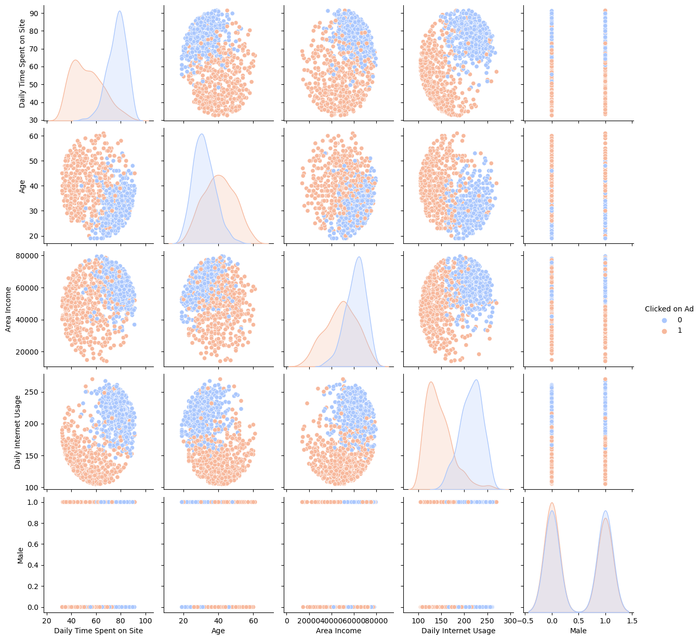

# Advertisement Insights - Logistic Regression

## Project Overview
This project provides insights from a fake advertising data set. **The primary objective is to build a model that will predict whether or not they will click on an ad based off the features of that user.** 

## Libraries Used
numpy, pandas, matplotlib, seaborn, sklearn

## Exploratory Data Analysis
### Exploring the Data and Relationships:
Age distribution of the users:

When plotting Age vs. Daily Time Spent on the Website, I found there were the most users ~30 years of age and spending ~80 minutes on the website

I found two clusters of users when plotting Daily Time Spent on Site vs Daily Internet Usage.

To explore further, I plotted the relationships of every numerical column. There was a lot of clusters of of the users that did or did not click on the users, despite the various columns/data points. For example, there are clusters on Area Income vs. Daily Internet Usage, Daily Internet Usage vs. Daily Time Spent on Site, and more. See below:

## Logistic Regression Model and Predictions
I created testing and training data, with the x-values being "Daily Time Spent on Site", "Age", "Area Income", "Daily Internet Usage", and "Male", and y-value being whether they clicked on the ad or not. I then fit my logistic regression model to the training data.

## Evaluation of Model Predictions

The model predicted what the Y values (whether or not they clicked on the ad) for the the test data. The model did pretty well

